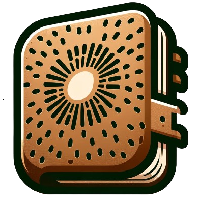

    <picture>
    
    </picture>
     
    <b><a href="https://github.com/DaLi-Jack/Notebooks/">DaLi's notebook</a></b>

I hope to write down the knowledge I learn in daily life while improving my English writing skills.

Some of the understandings in the notes might be incorrect, but I will continuously revise and refine them.

Feel free to open an issue for any discussion!

### If you want to build your own note site

All notes are in markdown format, and kept under `docs`.

I use [typora](https://typora.io/) for local editing, and periodically sync it to github.
The website is automatically deployed with [mkdocs](https://github.com/mkdocs/mkdocs) after each sync (with [this simple script](sync.ps1) on Windows), you can find the related note [here](https://note.kiui.moe/python/mkdocs/).

### Acknowledgements
* [mkdocs](https://github.com/mkdocs/mkdocs)
* [Kiui's notebook](https://github.com/ashawkey/Notebooks)