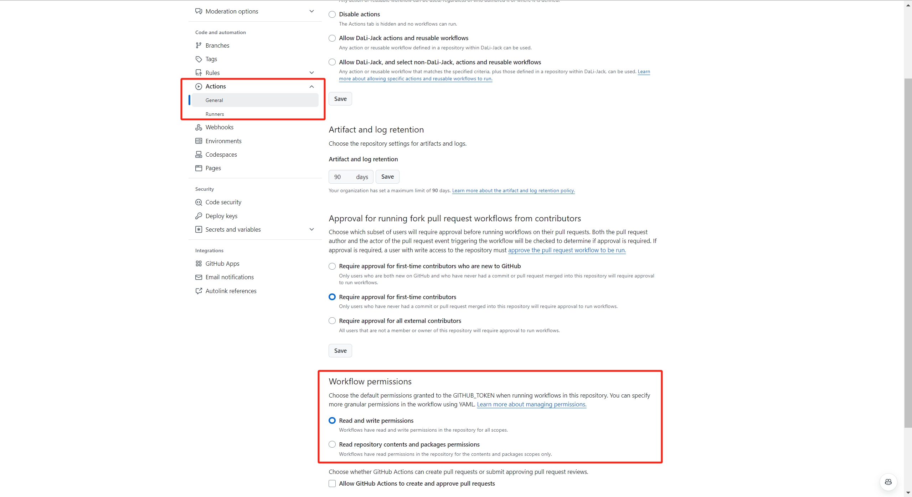
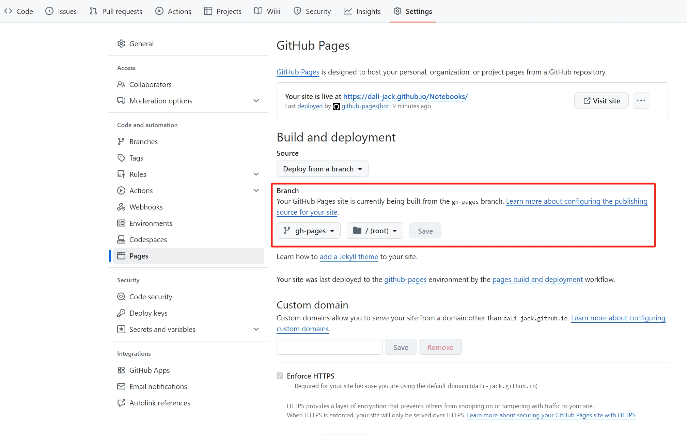

# mkdocs

### install

```bash
pip install mkdocs-material
```


### setup

Init a workspace:

```bash
mkdocs new .
```

Then add your markdowns to `docs`. Folder structure will be preserved in the navigation.


### configuration

edit `mkdocs.yml`, an example:

```yaml
site_name: DaLi's notebooks
theme:
  logo: _assets/icon.png
  favicon: _assets/icon.png
  name: material
  palette:
    primary: brown
    accent: lime
  features:
    - navigation.instant  
    - navigation.tracking
    - navigation.top
    - header.autohide
    - search.suggest
    - search.highlight
    - search.share
repo_url: https://github.com/DaLi-Jack/Notebooks
plugins:
  - search
markdown_extensions:
  - tables  
  - pymdownx.betterem
  - pymdownx.arithmatex:
      generic: true  
  - pymdownx.highlight
  - pymdownx.inlinehilite
  - pymdownx.keys
  - pymdownx.superfences  
  - pymdownx.tabbed:
      alternate_style: true 
  - mdx_truly_sane_lists # fix typora 2 space indentation, ref: https://github.com/mkdocs/mkdocs/issues/545

extra_javascript:
  - _js/mathjax.js
  - https://polyfill.io/v3/polyfill.min.js?features=es6
  - https://cdn.jsdelivr.net/npm/mathjax@3/es5/tex-mml-chtml.js      
```

The inline math plugin needs an extra file at `docs/_js/mathjax.js`:

```js
window.MathJax = {
    tex: {
      inlineMath: [["\\(", "\\)"]],
      displayMath: [["\\[", "\\]"]],
      processEscapes: true,
      processEnvironments: true
    },
    options: {
      ignoreHtmlClass: ".*|",
      processHtmlClass: "arithmatex"
    }
  };
  
  document$.subscribe(() => {
    MathJax.typesetPromise()
  })
```

Note that the default mathjax's line breaking can be hard to use, we can use a script to post-process the markdowns following [typora's setting](https://support.typora.io/Math/):
```python
import os
import re
import glob

files = glob.glob('docs/**/*.md', recursive=True)

# fix math blocks to be correctly rendered by mathjax:
# 1. $$..$$ will always be preceded and followed by an empty line, and there is no blank line inside.
# 2. always wrap all content within \displaylines{}

for file in files:
    with open(file, 'r') as f:
        lines = f.readlines()

    # naive matching $$...$$
    outside = True
    modified = False
    for i, line in enumerate(lines):
        if re.match('^\$\$', line) is not None:
            if outside:
                if lines[i+1] != '\displaylines{\n':
                    lines[i] = '\n$$\n\displaylines{\n'
                    modified = True
                outside = False
            else:
                if lines[i-1] != '}\n':
                    lines[i] = '}\n$$\n\n'
                    modified = True
                outside = True

        # remove blank lines inside
        if not outside and re.match('^\s*\n$', line):
            lines[i] = ''
            modified = True
            
    # remove excessive blank lines
    cnt = 0
    for i, line in enumerate(lines):
        if re.match('^\s*\n$', line):
            cnt += 1
            if cnt >= 3:
                lines[i] = ''
                modified = True
        else:
            cnt = 0

    if modified:
        lines = [line for line in lines if line != '']
    
    if not outside:
        print(f'[WARN] {file} unmatched $$, no modification is done.')
    else:
        if modified:
            with open(file, 'w') as f:
                f.writelines(lines)
            print(f'[INFO] {file} fixed.')
```


### serve

At the root of workspace:

```bash
mkdocs serve
```

by default it serves at `localhost:8000`


### deploy

Use github workflows to automatically deploy to github pages:

Create file at `.github/workflows/ci.yml`:

```yaml
name: ci 
on:
  push:
    branches: 
      - master # or main
jobs:
  deploy:
    runs-on: ubuntu-latest
    steps:
      - uses: actions/checkout@v2
      - uses: actions/setup-python@v2
        with:
          python-version: 3.x
      - run: pip install mkdocs-material
      - run: pip install mdx-truly-sane-lists
      - run: mkdocs gh-deploy --force
```

It is invoked at each push to master branch.

**Remember to enable Workflow permission.**



**Use gh-deploy branch**



